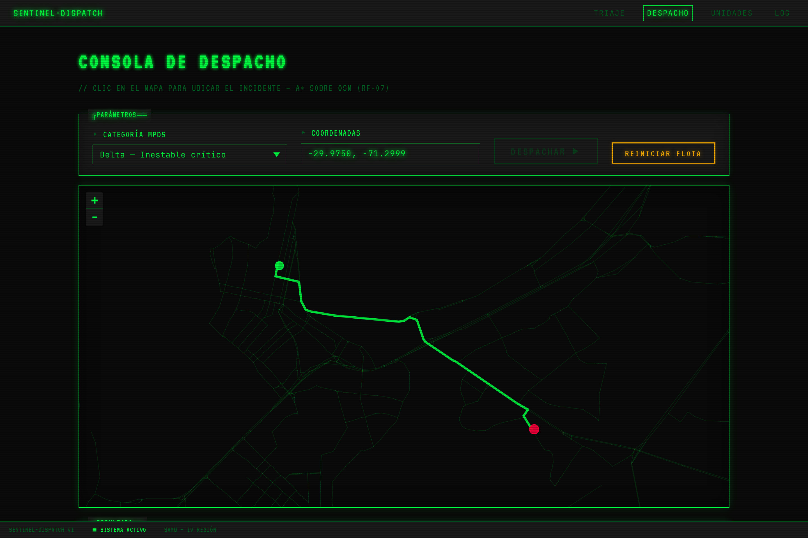
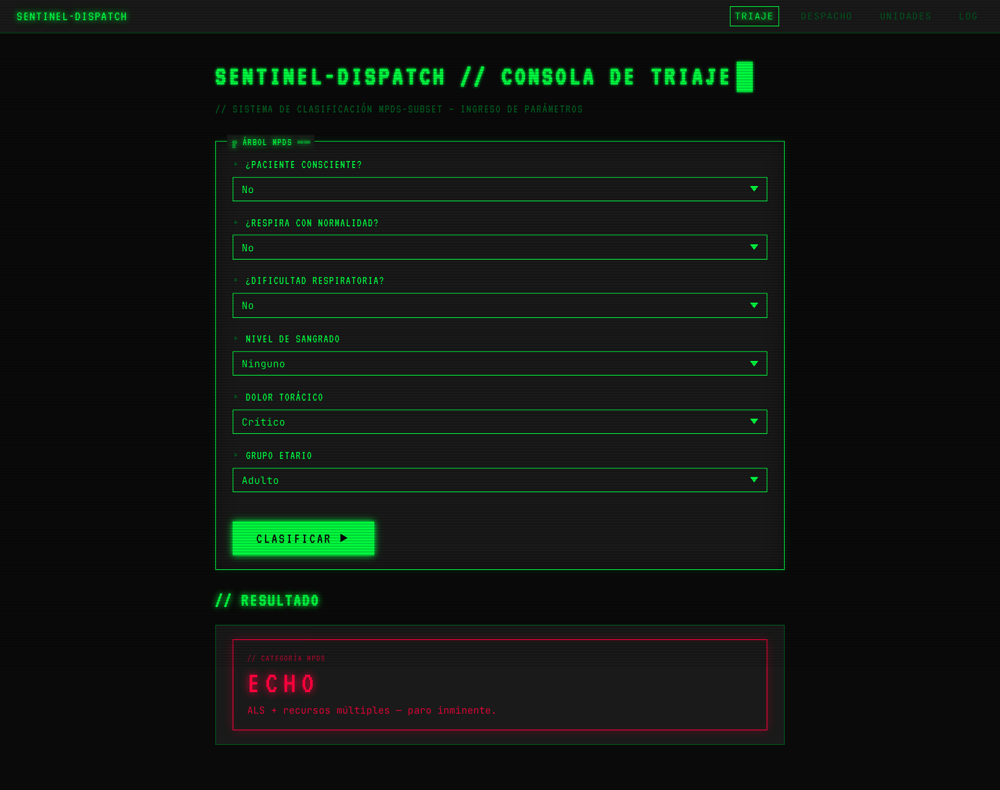
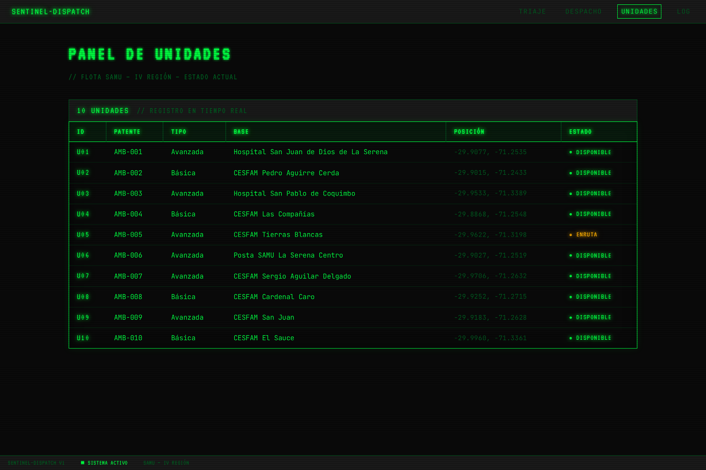
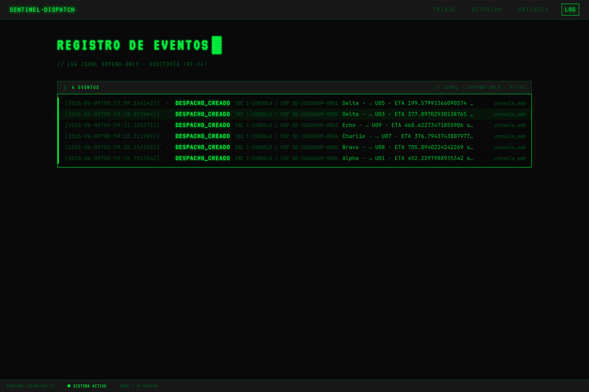

# Sentinel-Dispatch

> Motor de despacho inteligente para unidades de emergencia médica en la Región de Coquimbo (IV Región, Chile).
> Triaje **MPDS-subset**, ruteo **A\*** sobre grafo vial **OpenStreetMap** y una función de despacho **multiobjetivo** justificada.


<p align="center">
  
</p>

<p align="center"><sub>Consola de despacho — clic en el mapa ubica el incidente, A\* sobre OSM traza la ruta a la unidad óptima.</sub></p>

---

## Qué es

Reformulación rigurosa de una propuesta original de despacho de ambulancias, elevando el rigor científico sin perder la idea núcleo: **dirigir ambulancias de forma eficiente**. Cada decisión arbitraria de la propuesta inicial se reemplazó por un fundamento defendible:

| Antes (propuesta original) | Ahora (Sentinel-Dispatch) |
|---|---|
| Distancia Haversine (línea recta) | **Ruteo A\*** sobre la red vial real (OSMnx + NetworkX) |
| Velocidad fija 40–60 km/h | Peso por arista `longitud / (maxspeed · factor_hora · factor_sirena)` |
| Gravedad 1–10 subjetiva del operador | **Triaje MPDS-subset** (Alpha → Bravo → Charlie → Delta → Echo), estándar clínico real |
| Factores mágicos (2.5, "20 % combustible") | Función de costo `α·T_viaje + β·Penalización_idoneidad` justificada |
| Re-despacho como "override" vago | Política estricta (RN-06): solo si la nueva categoría es mayor, ≤50 % de ruta y cobertura validada |

> **Proyecto académico** (Gestión de Calidad del Software, UCEN 2026-1). No es un sistema certificado ni debe usarse en operación real de salud.

## La consola web

Consola del operador en estética **CRT/phosphor** — HTMX + Jinja2 + Leaflet, **sin build step**, servida por la misma app FastAPI (ADR-0022). Cuatro vistas:

<table>
  <tr>
    <td width="50%"></td>
    <td width="50%"></td>
  </tr>
  <tr>
    <td align="center"><b>TRIAJE</b><br><sub>árbol MPDS → categoría Alpha…Echo</sub></td>
    <td align="center"><b>UNIDADES</b><br><sub>flota SAMU con bases reales (hospitales / CESFAM)</sub></td>
  </tr>
  <tr>
    <td colspan="2"></td>
  </tr>
  <tr>
    <td colspan="2" align="center"><b>LOG</b><br><sub>registro de eventos JSONL append-only (RF-06)</sub></td>
  </tr>
</table>

La vista de **despacho** (imagen superior) es una consola "viva": al despachar, la unidad elegida pasa a `EnRuta`, se excluye del próximo despacho y se escribe un evento en el log. Es una conveniencia de la capa de interfaces (estado en memoria, no persiste) y **no toca el dominio ni la validación dual RT-02**.

## Arquitectura

Monorepo **políglota** con dos núcleos que calculan lo mismo y se validan entre sí:

- **`core-python/`** — núcleo de referencia (FastAPI + OSMnx + dominio puro), organizado en **Ports & Adapters** (ADR-0006): `domain/{triaje,routing,dispatch}` · `application` · `ports` · `adapters` · `interfaces/{cli,api}`.
- **`core-java/`** — implementación dual del núcleo de cálculo (triaje + A\* + función de costo) sobre el **mismo grafo y dataset**. Existe para satisfacer el requisito transversal **RT-01…RT-04** (validación cruzada Java ↔ Python).

El job de CI `compare` ejecuta ambos cores sobre el dataset y verifica paridad **bit-exacta** (RT-02). La persistencia es **JSONL append-only** (ADR-0007, supersede a SQLite).

```
sentinel-dispatch/
├── core-python/     núcleo de referencia: API FastAPI + CLI + dominio (triaje · routing · dispatch)
│   ├── src/         paquete sentinel_dispatch (domain, application, ports, adapters, interfaces)
│   ├── tests/       pytest (unit · integration · dataset · slow), cobertura ≥ 90 %
│   └── scripts/     utilitarios (build_graph.py, healthcheck, cloudflared)
├── core-java/       implementación dual para validación cruzada RT-01..RT-04 (Maven)
├── data/            dataset de aceptación · grafos OSM (GraphML) · oráculo OSRM
├── tools/           análisis y spikes (outliers, compare_outputs, perf, fixtures)
└── docs/            SRS · arquitectura (C4 + ADRs) · calidad (DoD, trazabilidad)
```

### Stack

| Capa | core-python (Python 3.12, `uv`) | core-java (Java 21, Maven) |
|---|---|---|
| Cálculo | OSMnx · NetworkX · Shapely (A\* sobre OSM) | JGraphT (A\* + GraphML) |
| Interfaz | FastAPI · Uvicorn · Jinja2 · HTMX · Leaflet · Typer | picocli |
| Datos | jsonlines (JSONL) · Pydantic v2 | Jackson |
| Calidad | Ruff · mypy strict · pytest-cov (gate 90 %) | JUnit 5 · AssertJ · JaCoCo · Spotless |

## Puesta en marcha

**Requisitos:** Python **3.12**, [`uv`](https://docs.astral.sh/uv/). Para el core de validación: **JDK 21** + Maven (opcional). Para ruteo/consola reales: el grafo OSM precomputado.

```bash
# 1. Instalar dependencias del core primario
cd core-python
make install                 # uv sync --all-groups

# 2. Precomputar el grafo OSM de la IV Región (~2 min, ~30–60 MB)
make build-graph

# 3. Levantar la consola web del operador (http://localhost:8000/consola/despacho)
make dev                     # uv run uvicorn sentinel_dispatch.interfaces.api.main:app --reload
```

> El `lifespan` de FastAPI carga el grafo OSM al arranque, por eso `make dev` tarda unos segundos en quedar listo.

### CLI

El paquete expone el comando `sentinel` (todos desde `core-python/`, con `uv run`):

| Comando | Qué hace |
|---|---|
| `sentinel triaje classify` | Clasifica una respuesta del operador en una categoría MPDS |
| `sentinel triaje run-dataset` | Corre el dataset de aceptación contra el árbol y compara con el *ground truth* |
| `sentinel run-dataset` | Despacha sobre un dataset de incidentes y emite un JSONL por incidente (contrato RT-02, ADR-0017) |
| `sentinel export --formato {csv,json}` | Exporta el log JSONL a CSV/JSON para auditoría (RF-11), sin tocar el log canónico |
| `sentinel simular` | Modo simulación sobre flota ficticia, sin afectar el estado operativo (RF-12) |

```bash
cd core-python
uv run sentinel --help
uv run sentinel triaje run-dataset --in ../data/dataset/incidentes.json
```

### Tests y calidad

```bash
cd core-python
make test          # suite completa con cobertura (gate 90 %)
make test-fast     # solo unit tests rápidos
make lint          # ruff check + format --check
make typecheck     # mypy strict
make ci            # lint + typecheck + test (lo que corre en GitHub Actions)

# Validación dual Python ↔ Java (RT-02), desde la raíz del monorepo:
make compare       # tools/compare_outputs.py compara ambos outputs
```

## Estado y calidad

| Métrica | Valor |
|---|---|
| Tests | **324** Python · **186** Java (suites verdes) |
| Validación dual RT-02 | **12 / 12 OK · bit-exacto** (Python ↔ Java) |
| Cobertura Python | **90.33 %** (gate 90 %) |
| ADRs | **22** decisiones registradas (`docs/architecture/decisions/`) |
| Ruteo A\* vs OSRM (CP-01a-95) | **0.897** dentro de ±30 %, IC95 inferior 0.860 ≥ 0.75 (cumple) |

**Hitos** (plazo académico mayo → julio 2026):

| Hito | Alcance | Estado |
|---|---|---|
| H0 | Reestructuración a monorepo + Ports & Adapters | ✓ |
| H1 | Triaje MPDS + validador de coordenadas | ✓ |
| H2 | Ruteo A\* sobre OSM + IT-01 vs OSRM | ✓ |
| H3 | Despacho + selección óptima + re-despacho + saturación | ✓ |
| H3-J | Núcleo Java + validación dual RT-02 | ✓ |
| H4 | Dataset completo + log JSONL + exportador + simulación | ✓ (FTR-03 aprobado) |
| H5 | Validación de ruteo cerrada · consola web (bonus) · **informe v1.0 + tag** | En curso |

Cumplimiento funcional: los **12 RFs** del SRS están cubiertos — RF-07 (ruta en mapa) y RF-09 (panel de unidades) los aporta la consola web (ADR-0022, capa de presentación, bonus F5). Único requisito diferido: **RN-10** (autenticación + HTTPS), regla de negocio fuera del scope v1.

## Documentación

- [SRS — Especificación de Requisitos](docs/SRS.md) · requisitos, reglas de negocio, dataset y casos de prueba
- [Arquitectura — overview](docs/architecture/overview.md) · [Modelo C4](docs/architecture/c4.md) · [ADRs](docs/architecture/decisions)
- [Matriz de trazabilidad](docs/quality/trazabilidad.md) · [Estrategia de testing](docs/quality/testing-strategy.md) · [Definition of Done](docs/quality/definition-of-done.md)
- [Modelo de datos](docs/data-model.md) · [Contrato de API (OpenAPI)](docs/api.yaml)

ADRs de referencia: [0001 Stack](docs/architecture/decisions) · 0006 Ports & Adapters · 0008 Validación dual · 0010 Routing A\* + OSRM · 0022 Rescate del frontend HTMX.

## Equipo

- **Benjamín López** — owner
- **Fernando Godoy M.**
- Prof. **Gonzalo Honores** (GCS, UCEN 2026-1)

## Licencia

[MIT](LICENSE)
