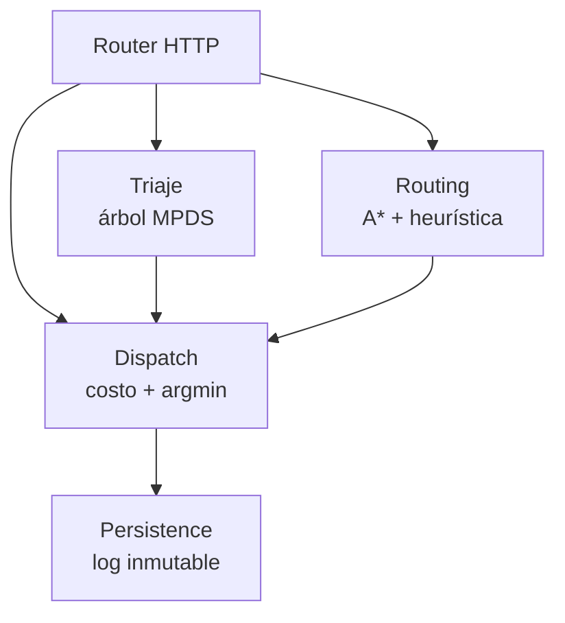

# C4 Nivel 3 — Components

> **Estado:** placeholder. Solo se diagramarán componentes no triviales (Triaje, Ruteo A*, Despacho).

## Container: API (FastAPI)

(Detalle por componente pendiente F2.)
