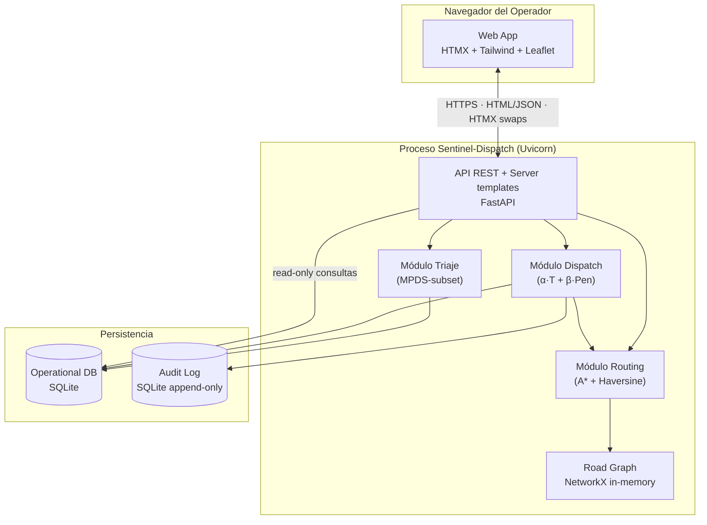

# C4 Nivel 2 — Container (vista lógica)

> **Vista lógica** de containers (procesos/apps deployables) y sus interacciones.
> Para el deployment físico (hosts, red, contenedores Docker concretos), ver [`c4-deployment.md`](c4-deployment.md).

## Containers

| Container | Tecnología | Responsabilidad |
|---|---|---|
| **Web App** | HTMX + Jinja2 + Tailwind + Leaflet | UI retro CRT/phosphor servida desde el mismo proceso FastAPI. Sin SPA: server-rendered + HTMX swaps. |
| **API** | FastAPI + Uvicorn (Python 3.12, ASGI) | Endpoints REST + render de templates. Aloja los módulos de dominio (triaje, routing, dispatch). |
| **Operational DB** | SQLite + SQLAlchemy 2.x async + Alembic | Estado operacional: incidentes, unidades, asignaciones. Archivo único `data/sentinel.db`. |
| **Audit Log** | SQLite (tabla append-only) o JSONL | Log inmutable de decisiones de despacho (R-08 trazabilidad clínica). Co-residente en `data/sentinel.db` v1; separable a almacenamiento WORM en v2. |
| **Road Graph** | OSMnx + NetworkX (in-memory) | Grafo vial de la IV Región pre-cargado al arranque desde `data/graphs/coquimbo.graphml`. Acceso solo-lectura. |

## Relaciones

## Notas de diseño

- **Monolito modular** por decisión consciente (ver [ADR-0002](decisions/0002-monolito-modular.md)). Cada módulo (`triaje/`, `routing/`, `dispatch/`) tiene fronteras explícitas; la opción de extraer a microservicios queda como camino de evolución, no como objetivo v1.
- **Audit Log como container separado** aunque co-resida con la BD operacional: la separación lógica permite migrar a almacenamiento WORM sin tocar el resto.
- **Road Graph** se modela como container porque tiene ciclo de vida propio (pre-build offline vía `scripts/build_graph.py`, carga al arranque, no muta en runtime).
