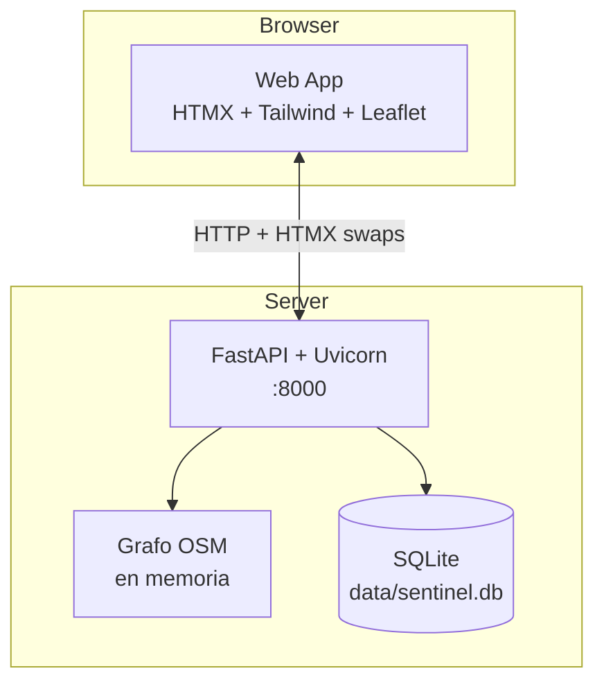

# C4 Nivel 2 — Container

> **Estado:** placeholder. Diagrama detallado pendiente F2 (entregable Tarea 2026-05-07 — **Diseño Arquitectura Físico**).

## Containers

- **Web App (HTMX + Jinja + Tailwind + Leaflet)** — frontend retro CRT, servido por FastAPI.
- **API (FastAPI + Uvicorn)** — endpoints REST + servidor de templates.
- **BD (SQLite + SQLAlchemy 2.x)** — archivo único `data/sentinel.db`.
- **Grafo OSM (en memoria)** — `data/graphs/coquimbo.graphml` cargado al arranque vía OSMnx.

## Diagrama Mermaid (placeholder)

