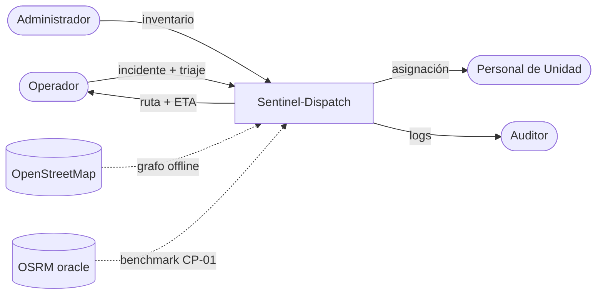

# C4 Nivel 1 — Context

> **Estado:** placeholder. Diagrama final pendiente F2 (entregable Tarea 2026-05-07).

## Sistema

**Sentinel-Dispatch** — software único; no se descompone en este nivel.

## Actores externos

- **Operador de Despacho** (humano) — ingresa incidentes, confirma despachos.
- **Personal de Unidad** (humano) — recibe asignación.
- **Administrador de Flota** (humano) — gestiona inventario.
- **Auditor** (humano) — consulta logs.

## Sistemas externos

- **OpenStreetMap** (OSM) — fuente del grafo vial. Consulta offline vía OSMnx (snapshot pre-cargado).
- **OSRM** (oracle, solo CP-01) — benchmark externo de precisión de ruteo.

## Diagrama Mermaid (placeholder)

