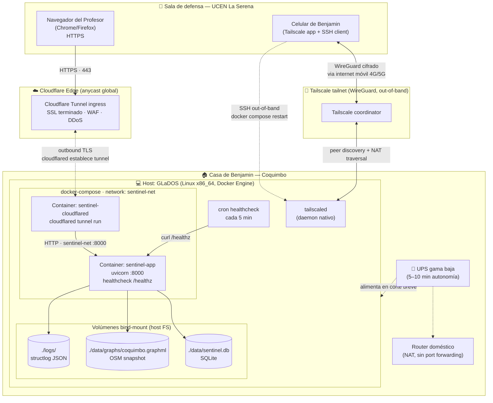

# Diseño de Arquitectura Física (C4 Nivel 4 — Deployment)

> **Entregable académico GCS — bloque Diseño** (Tarea 2026-05-07).
> Mapea los containers lógicos de [`c4-container.md`](c4-container.md) sobre infraestructura física real para la **defensa en vivo** del semestre.

## Topología

Sentinel-Dispatch v1 corre en el PC de escritorio de Benjamin (host `GLaDOS`), expuesto al exterior vía **Cloudflare Tunnel** sin abrir puertos en el router doméstico. El profesor accede desde la sala de defensa por HTTPS público.

Decisión completa y alternativas evaluadas: [ADR-0005 — Deploy demo](decisions/0005-deploy-demo.md).

## Nodos físicos

| Nodo | Hardware / Plataforma | Rol |
|---|---|---|
| **GLaDOS** | PC escritorio Benjamin · Linux x86_64 · Docker Engine 27.x | Host único de la aplicación. Corre Docker Compose con app + cloudflared. |
| **Router doméstico** | Router ISP estándar · NAT · sin port forwarding | Provee uplink. **No** se exponen puertos entrantes (toda exposición es vía Cloudflare Tunnel outbound). |
| **UPS** | UPS gama baja (~600 VA) · ~5–10 min autonomía | Sobrevive cortes de luz breves durante la defensa (mitigación 2 de ADR-0005). |
| **Cloudflare Edge** | Red anycast global · plan free | Termina TLS, aplica WAF/DDoS gratis, enruta tráfico al tunnel. |
| **Tailscale coordinator** | SaaS Tailscale · plan personal free | Coordina handshake WireGuard celular ↔ GLaDOS para acceso out-of-band. |
| **Celular Benjamin** | Smartphone · Tailscale app · cliente SSH | Reinicio remoto de containers desde la sala de defensa si algo se cae. |
| **Navegador del Profesor** | Cualquier navegador moderno · WiFi UCEN o datos móviles | Cliente único de la demo. |

## Containers Docker

| Container | Imagen base | Puertos | Volúmenes | Restart policy |
|---|---|---|---|---|
| `sentinel-app` | `python:3.12-slim` (multi-stage build con `uv`) | `8000/tcp` interno a `sentinel-net` | `./data:/app/data`, `./logs:/app/logs` | `unless-stopped` |
| `sentinel-cloudflared` | `cloudflare/cloudflared:latest` | egress TLS 443 a `*.cloudflare.com` | `./cloudflared:/etc/cloudflared` (token) | `unless-stopped` |

Definición operativa: [`docker-compose.yml`](../../docker-compose.yml) con perfiles `dev` (sin cloudflared) y `demo` (con cloudflared).

## Red y protocolos

| Tramo | Protocolo | Puerto | Cifrado | Notas |
|---|---|---|---|---|
| Profesor → Cloudflare Edge | HTTPS | 443 | TLS 1.3 (cert Cloudflare) | URL pública `*.trycloudflare.com` o subdominio. |
| Cloudflare Edge → cloudflared (GLaDOS) | QUIC/HTTP2 | 443 outbound | TLS dentro del tunnel | **Outbound desde casa** → no requiere abrir puertos en NAT. |
| cloudflared → sentinel-app | HTTP | 8000 | Plano (red Docker interna) | Aceptable: solo cruza red bridge dentro del host. |
| sentinel-app → SQLite / OSM graph | filesystem | — | — | Bind mount al FS del host. |
| Celular ↔ GLaDOS (out-of-band) | WireGuard (UDP) | 41641 | WireGuard (ChaCha20-Poly1305) | Vía Tailscale, peer-to-peer cuando posible. |
| Celular → GLaDOS (acción remota) | SSH sobre WireGuard | 22 (en tailnet) | TLS WireGuard + SSH | Solo accesible dentro del tailnet privado. |

## Flujo de la defensa (request del profesor)

1. Profesor abre `https://<sentinel>.trycloudflare.com/` desde la sala UCEN.
2. DNS resuelve a anycast Cloudflare; conexión TLS termina en el edge más cercano.
3. Cloudflare reusa la conexión persistente que `sentinel-cloudflared` mantiene outbound desde casa.
4. `cloudflared` reenvía la request HTTP plano por la red Docker interna a `sentinel-app:8000`.
5. FastAPI consulta SQLite + grafo OSM en memoria, calcula ruta A*, retorna HTML server-rendered + parciales HTMX.
6. La respuesta vuelve por el mismo tunnel hasta el navegador del profesor.

Latencia esperada: 80–200 ms per request (RTT Coquimbo→edge CF + procesamiento local). Aceptable para demo interactiva.

## Resiliencia operativa

Las cinco mitigaciones de [ADR-0005](decisions/0005-deploy-demo.md) están materializadas en este diagrama:

| Mitigación | Componente físico |
|---|---|
| 1. Drill T-7d antes de defensa | (procedural; ver [`runbook.md`](../operations/runbook.md)) |
| 2. UPS para corte de luz breve | nodo `UPS` |
| 3. Screencast pre-grabado en celular + Drive | celular del operador |
| 4. Reinicio remoto desde celular | tailnet WireGuard out-of-band (`Phone ↔ TSDaemon`) |
| 5. Cron healthcheck local | `CronHC` ejecuta `scripts/healthcheck.sh` cada 5 min |
| 6. `restart: unless-stopped` en compose | políticas de los dos containers |

## Lo que **no** se despliega

- **Sin staging/prod separados** v1: ambiente único `local` que se expone vía Cloudflare durante la defensa. Justificación: equipo 1–2 personas, ROI académico nulo en pipelines multi-ambiente. Documentado en [Metodología aplicada](../../../../Áreas/Universidad/2026-S1/Gestión%20de%20Calidad%20del%20Software/Proyecto%20Sentinel-Dispatch/Metodología%20aplicada.md).
- **Sin orquestador** (k8s, Nomad): un solo host, dos containers; Docker Compose alcanza y sobra.
- **Sin réplica de BD ni HA**: SQLite single-file. Backup vía copia del archivo antes de la defensa.
- **Sin métricas DORA medidas**: deployment count = 1 en la defensa; no hay población estadística.

## Referencias

- [`c4-container.md`](c4-container.md) — vista lógica que se mapea acá.
- [ADR-0005 — Deploy demo](decisions/0005-deploy-demo.md) — decisión y alternativas.
- [`scripts/cloudflared-setup.md`](../../scripts/cloudflared-setup.md) — playbook reproducible.
- [`docs/operations/runbook.md`](../operations/runbook.md) — pre-flight checks T-7d/T-24h/T-2h/T-30min.
