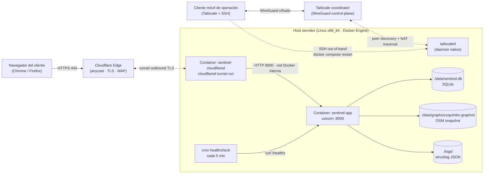

# Diseño de Arquitectura Física (C4 Nivel 4 — Deployment)

> **Entregable académico GCS — bloque Diseño** (Tarea 2026-05-07).
> Mapea los containers lógicos de [`c4-container.md`](c4-container.md) sobre infraestructura física real para la demo en vivo del semestre.

## Topología

Sentinel-Dispatch v1 corre en un host servidor único, expuesto al exterior vía **Cloudflare Tunnel** sin abrir puertos en el router de borde. El cliente accede al sistema por HTTPS público desde cualquier ubicación con conectividad.

Decisión completa y alternativas evaluadas: [ADR-0005 — Deploy demo](decisions/0005-deploy-demo.md).

## Nodos físicos

| Nodo | Plataforma | Rol |
|---|---|---|
| **Host servidor** | Linux x86_64 · Docker Engine 27.x | Host único de la aplicación. Corre Docker Compose con app + cloudflared. |
| **Router de borde** | Router con NAT, sin port forwarding | Provee uplink. No se exponen puertos entrantes (toda exposición es vía Cloudflare Tunnel outbound). |
| **Cloudflare Edge** | Red anycast global · plan free | Termina TLS, aplica WAF/DDoS gratis, enruta tráfico al tunnel. |
| **Tailscale coordinator** | SaaS Tailscale · plan personal free | Coordina handshake WireGuard cliente móvil ↔ host para acceso out-of-band. |
| **Cliente móvil de operación** | Smartphone con Tailscale + cliente SSH | Reinicio remoto de containers desde fuera de la red del host si algo se cae. |
| **Navegador del cliente** | Cualquier navegador moderno | Cliente único de la demo. |

## Containers Docker

| Container | Imagen base | Puertos | Volúmenes | Restart policy |
|---|---|---|---|---|
| `sentinel-app` | `python:3.12-slim` (multi-stage build con `uv`) | `8000/tcp` interno a `sentinel-net` | `./data:/app/data`, `./logs:/app/logs` | `unless-stopped` |
| `sentinel-cloudflared` | `cloudflare/cloudflared:latest` | egress TLS 443 a `*.cloudflare.com` | `./cloudflared:/etc/cloudflared` (token) | `unless-stopped` |

Definición operativa: [`docker-compose.yml`](../../docker-compose.yml) con perfiles `dev` (sin cloudflared) y `demo` (con cloudflared).

## Red y protocolos

| Tramo | Protocolo | Puerto | Cifrado | Notas |
|---|---|---|---|---|
| Cliente → Cloudflare Edge | HTTPS | 443 | TLS 1.3 (cert Cloudflare) | URL pública `*.trycloudflare.com` o subdominio. |
| Cloudflare Edge → cloudflared | QUIC/HTTP2 | 443 outbound | TLS dentro del tunnel | Outbound desde el host → no requiere abrir puertos en NAT. |
| cloudflared → sentinel-app | HTTP | 8000 | Plano (red Docker interna) | Aceptable: solo cruza red bridge dentro del host. |
| sentinel-app → SQLite / OSM graph | filesystem | — | — | Bind mount al FS del host. |
| Cliente móvil ↔ host (out-of-band) | WireGuard (UDP) | 41641 | WireGuard (ChaCha20-Poly1305) | Vía Tailscale, peer-to-peer cuando posible. |
| Cliente móvil → host (acción remota) | SSH sobre WireGuard | 22 (en tailnet) | TLS WireGuard + SSH | Solo accesible dentro del tailnet privado. |

## Flujo de una request

1. Cliente abre la URL pública (`https://<sentinel>.trycloudflare.com/`).
2. DNS resuelve a anycast Cloudflare; conexión TLS termina en el edge más cercano.
3. Cloudflare reusa la conexión persistente que `sentinel-cloudflared` mantiene outbound desde el host.
4. `cloudflared` reenvía la request HTTP plano por la red Docker interna a `sentinel-app:8000`.
5. FastAPI consulta SQLite + grafo OSM en memoria, calcula ruta A*, retorna HTML server-rendered + parciales HTMX.
6. La respuesta vuelve por el mismo tunnel hasta el navegador.

Latencia esperada: 80–200 ms per request (RTT cliente↔edge CF + procesamiento local). Aceptable para demo interactiva.

## Resiliencia operativa

Las mitigaciones de [ADR-0005](decisions/0005-deploy-demo.md) que se materializan en infraestructura:

| Mitigación | Componente físico |
|---|---|
| Reinicio remoto out-of-band | tailnet WireGuard (`Cliente móvil ↔ tailscaled`) |
| Cron healthcheck local | `CronHC` ejecuta `scripts/healthcheck.sh` cada 5 min |
| `restart: unless-stopped` | políticas de los dos containers |

Las mitigaciones procedurales (drill previo, screencast de respaldo, energía de respaldo si está disponible) viven en [`runbook.md`](../operations/runbook.md), no en este diagrama.

## Lo que **no** se despliega

- **Sin staging/prod separados** v1: ambiente único `local` que se expone vía Cloudflare durante la demo. Justificación: equipo 1–2 personas, ROI académico nulo en pipelines multi-ambiente.
- **Sin orquestador** (k8s, Nomad): un solo host, dos containers; Docker Compose alcanza y sobra.
- **Sin réplica de BD ni HA**: SQLite single-file. Backup vía copia del archivo antes de la demo.
- **Sin métricas DORA medidas**: deployment count = 1 en la demo; no hay población estadística.

## Referencias

- [`c4-container.md`](c4-container.md) — vista lógica que se mapea acá.
- [ADR-0005 — Deploy demo](decisions/0005-deploy-demo.md) — decisión y alternativas.
- [`scripts/cloudflared-setup.md`](../../scripts/cloudflared-setup.md) — playbook reproducible.
- [`docs/operations/runbook.md`](../operations/runbook.md) — pre-flight checks.
