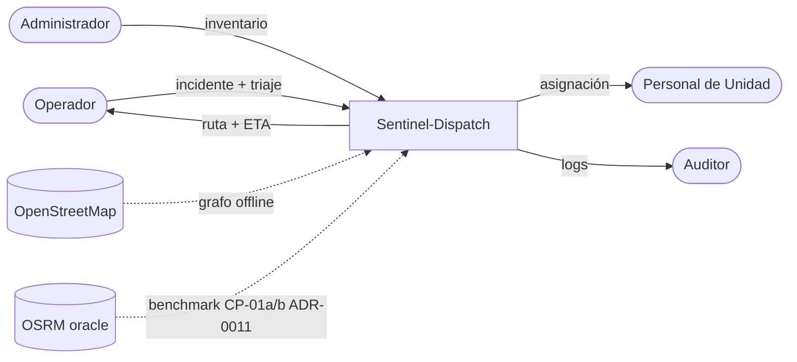
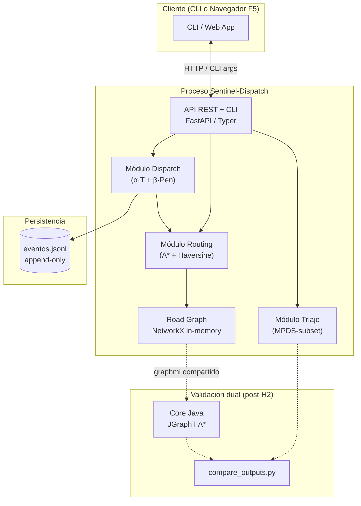
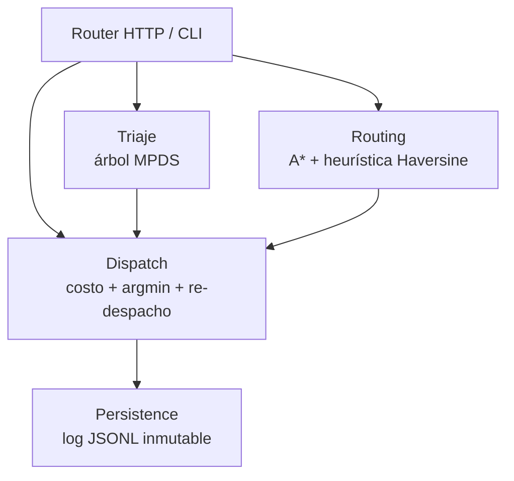
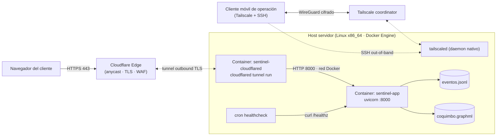
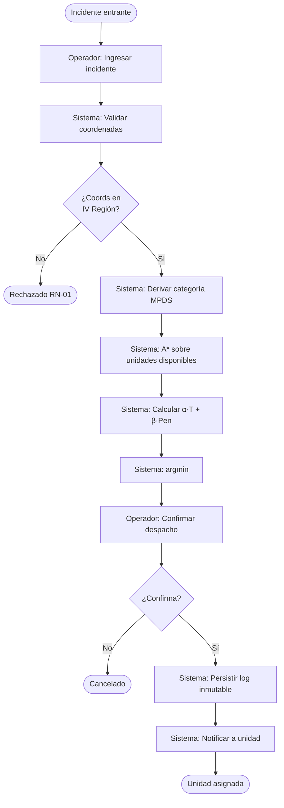

# Arquitectura — C4 + BPMN

> Vistas C4 (niveles 1–4) + diagrama BPMN del proceso principal. Consolida lo que antes estaba en 5 archivos separados (`c4-context.md`, `c4-container.md`, `c4-components.md`, `c4-deployment.md`, `process-bpmn.md`).
>
> Para el contexto general ver [`overview.md`](overview.md). Para decisiones arquitectónicas costosas ver [`decisions/`](decisions/).

## Nivel 1 — Context

Sentinel-Dispatch es un sistema único; en este nivel no se descompone.

**Actores externos** (humanos):
- **Operador de Despacho** — ingresa incidentes, confirma despachos.
- **Personal de Unidad** — recibe asignación.
- **Administrador de Flota** — gestiona inventario.
- **Auditor** — consulta logs.

**Sistemas externos**:
- **OpenStreetMap (OSM)** — fuente del grafo vial. Consumo offline vía OSMnx (snapshot pre-cargado).
- **OSRM** — oracle externo para CP-01a/b (benchmark de paridad de ruta vs A* propio; ver [ADR-0011](decisions/0011-reformulacion-criterio-it01.md)).

## Nivel 2 — Container (vista lógica)

| Container | Tecnología | Responsabilidad |
|---|---|---|
| **Web App** | HTMX + Jinja2 + Tailwind + Leaflet (diferido a F5, ADR-0004) | UI servida desde el mismo proceso FastAPI. Sin SPA |
| **API** | FastAPI + Uvicorn (Python 3.12, ASGI) | Endpoints REST + render de templates. Aloja los módulos de dominio |
| **CLI** | Typer/Click | Entry point alternativo para ejecutar dataset y comparaciones |
| **Log inmutable** | JSONL append-only (ADR-0007, supersede ADR-0003) | Eventos de despacho. Inmutabilidad por construcción |
| **Road Graph** | OSMnx + NetworkX (in-memory) | Grafo vial IV Región pre-cargado al arranque desde `data/graphs/coquimbo.graphml` |
| **Core Java** | Java 21 + Maven + JGraphT (ADR-0008) | Implementación dual del núcleo de cálculo para RT-01..RT-04 |

## Nivel 3 — Components

Solo se diagraman containers con lógica no trivial. Detalle por componente vive en docstrings y ADRs; el diagrama sirve como mapa visual.

Estructura interna en `core-python/src/sentinel_dispatch/` siguiendo Ports & Adapters liviano (ADR-0006): `domain/` (lógica pura), `application/` (casos de uso), `ports/` (interfaces), `adapters/` (OSMnx, JSONL), `interfaces/` (CLI, API).

## Nivel 4 — Deployment (vista física)

> Decisión completa y alternativas: [ADR-0005 — Deploy demo](decisions/0005-deploy-demo.md) — actualmente **diferido a F4**. Esta sección documenta el plan target.

Sentinel-Dispatch v1 corre en un host servidor único, expuesto al exterior vía **Cloudflare Tunnel** sin abrir puertos en el router de borde.

**Nodos físicos**: Host servidor (`GLaDOS`), router de borde sin NAT, Cloudflare Edge (free), Tailscale coordinator (free).

**Resiliencia operativa** (ver ADR-0005): tunnel probado T-7d, UPS si disponible, screencast pre-grabado, Tailscale para reinicio remoto desde celular, cron healthcheck cada 5 min.

**Lo que NO se despliega**: sin staging/prod separados, sin orquestador (k8s), sin réplica BD ni HA. Justificación: equipo 1–2 personas, plazo 2 meses, defensa puntual.

## BPMN — Proceso principal

> Archivo fuente: [`process-bpmn.bpmn`](process-bpmn.bpmn) — BPMN 2.0 XML. Abre en [bpmn.io](https://demo.bpmn.io), Camunda Modeler, o cualquier editor compatible.

Cobertura: dos procesos del dominio.

**Flujo principal** (3 lanes: Operador / Sistema / Unidad):

1. **Inicio** — incidente entrante (start event del operador).
2. **Ingresar incidente** (User Task — Operador): coordenadas + síntomas.
3. **Validar coordenadas** (Service Task — Sistema): RN-01 (rango IV Región).
4. **Gateway** `¿Coords en IV Región?`: No → end rechazado.
5. **Derivar categoría MPDS** (Service Task — Sistema): árbol MPDS-subset → Echo/Delta/Charlie/Bravo/Alpha.
6. **Calcular A*** (Service Task — Sistema): A* + Haversine por unidad disponible.
7. **Calcular costo** (Service Task — Sistema): `α·T + β·Pen` por unidad.
8. **Proponer unidad** (Service Task — Sistema): `argmin`.
9. **Confirmar despacho** (User Task — Operador): revisa y confirma o cancela.
10. **Gateway** `¿Operador confirma?`: No → end cancelado.
11. **Persistir log inmutable** (Service Task — Sistema): R-08 trazabilidad.
12. **Notificar asignación** (Service Task — lane Unidad).
13. **Fin** — unidad asignada.

**Sub-proceso de re-despacho** (RN-06): event sub-process **no interruptivo**, disparado por señal `IncidenteMayorCategoria` cuando se cumplen las 4 condiciones. Sistema propone → operador confirma/rechaza → sistema registra decisión en log.

## Trazabilidad con el SRS

| Elemento del modelo | Requisito SRS |
|---|---|
| `ValidarCoords` + Gateway | RN-01 (coordenadas IV Región) |
| `TriajeMPDS` | RF-02 (MPDS-subset) |
| `CalcularAStar` | RF-03 (A* + Haversine sobre OSM) |
| `CalcularCosto` + `ProponerUnidad` | RF-04, RF-05 (función multiobjetivo, argmin) |
| `PersistirLog` | RF-06, RN-03, RN-07, R-08 (log inmutable) |
| `SubProcess_ReDespacho` | RF-08, RN-06 (re-despacho condicional) |
| `EndEvent_Asignado` | NFPA 1710 (Echo/Delta ≤ 8 min) |
| Core Java + compare | RT-01..RT-04 (validación dual) |

## Referencias

- [`overview.md`](overview.md) — entrada de alto nivel.
- [`decisions/`](decisions/) — ADRs (estilo arquitectónico, stack, ports & adapters, persistencia, deploy).
- [`process-bpmn.bpmn`](process-bpmn.bpmn) — fuente BPMN 2.0 editable.
