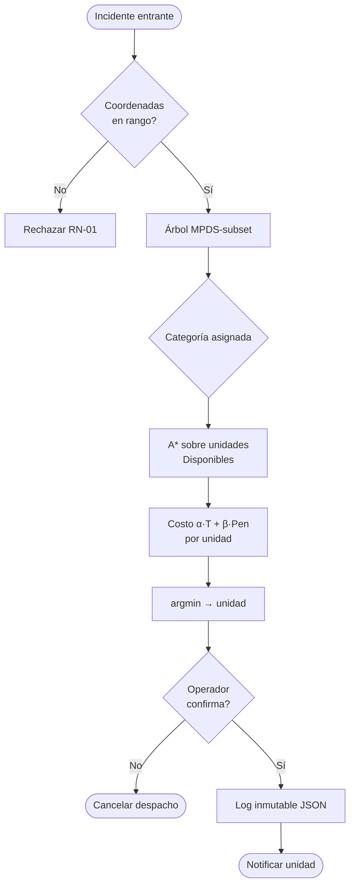

# BPMN — Proceso principal de despacho

> **Estado:** placeholder. XML BPMN 2.0 pendiente en `process-bpmn.bpmn` (entregable Tarea 2026-05-07 — **Diseño Lógico Funcional — Proceso principal en BPMN**).

## Flujo principal

1. Operador ingresa incidente (coordenadas + árbol triaje).
2. Sistema valida coordenadas (RN-01).
3. Sistema deriva categoría MPDS.
4. Sistema calcula A* sobre unidades disponibles.
5. Sistema calcula costo `α·T + β·Pen` por unidad.
6. Sistema propone unidad de menor costo (argmin).
7. Operador confirma despacho.
8. Sistema persiste log inmutable.
9. Personal de unidad recibe asignación.

## Sub-flujo de re-despacho

Si llega incidente nuevo de mayor categoría y se cumplen las 4 condiciones (RN-06), el sistema propone re-despacho. Operador confirma o rechaza. Decisión registrada en log.

## Render Mermaid de respaldo

