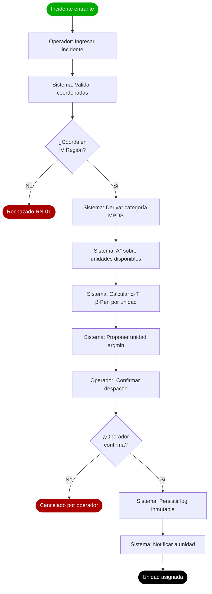
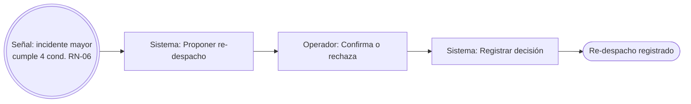

# Diseño Lógico Funcional — Proceso principal en BPMN

> **Entregable académico GCS — bloque Diseño** (Tarea 2026-05-07).
> Modelo BPMN 2.0 estándar del proceso de despacho de unidades de emergencia.

## Archivo fuente

- **BPMN 2.0 XML:** [`process-bpmn.bpmn`](process-bpmn.bpmn) — fuente de verdad. Abre directo en [bpmn.io](https://demo.bpmn.io), Camunda Modeler, o cualquier editor BPMN compatible.
- **Mermaid de respaldo:** sección al final de este archivo, para vista rápida en GitHub/Obsidian sin abrir el modeler.

## Cobertura del modelo

El BPMN cubre **dos procesos** del dominio:

1. **Flujo principal** (lane Operador + Sistema + Unidad): de incidente entrante a unidad asignada.
2. **Sub-proceso de re-despacho** (event sub-process disparado por señal): cuando llega un incidente de mayor categoría que cumple las 4 condiciones de RN-06.

## Lanes (responsabilidades)

| Lane | Quién | Tareas que ejecuta |
|---|---|---|
| **Operador de Despacho** | Humano (operador en consola) | Ingresar incidente, confirmar despacho propuesto, confirmar/rechazar re-despacho |
| **Sistema Sentinel-Dispatch** | Software (FastAPI + módulos triaje/routing/dispatch) | Validar coordenadas, derivar categoría MPDS, calcular A*, calcular costo, proponer unidad, persistir log |
| **Personal de Unidad** | Humano (tripulación de la unidad despachada) | Recibir notificación de asignación |

## Flujo principal — narrativa

1. **Inicio** — Llega un incidente al sistema (start event del operador).
2. **Ingresar incidente** (User Task — Operador): operador captura coordenadas + síntomas en la consola.
3. **Validar coordenadas** (Service Task — Sistema): verifica que las coordenadas estén dentro de la IV Región (RN-01).
4. **Gateway exclusivo** `¿Coords en IV Región?`:
   - **No** → End: rechazado por RN-01.
   - **Sí** → continúa al triaje.
5. **Derivar categoría MPDS** (Service Task — Sistema): árbol MPDS-subset asigna Echo / Delta / Charlie / Bravo / Alpha / Omega.
6. **Calcular A\*** (Service Task — Sistema): A* sobre el grafo OSM con heurística Haversine, para cada unidad disponible.
7. **Calcular costo** (Service Task — Sistema): `α · T(unidad) + β · Pen(unidad)` por cada unidad candidata.
8. **Proponer unidad de menor costo** (Service Task — Sistema): `argmin` sobre el costo.
9. **Confirmar despacho** (User Task — Operador): el operador revisa y confirma o cancela.
10. **Gateway exclusivo** `¿Operador confirma?`:
    - **No** → End: cancelado.
    - **Sí** → persistir + notificar.
11. **Persistir decisión en log inmutable** (Service Task — Sistema): R-08 trazabilidad clínica.
12. **Notificar asignación** (Service Task — lane Unidad): personal recibe la asignación.
13. **Fin** — unidad asignada.

## Sub-proceso de re-despacho (RN-06)

**Disparador:** señal `IncidenteMayorCategoria` cuando llega un incidente nuevo que cumple las 4 condiciones de RN-06 (categoría estrictamente mayor que la asignada, ETA del nuevo desde la unidad ya despachada es razonable, no degrada el incidente original más allá del umbral, etc.).

**Naturaleza del sub-proceso:** event sub-process **no interruptivo** (`isInterrupting="false"`) — corre en paralelo al flujo principal, no lo cancela.

Pasos:

1. Sistema **propone re-despacho** de la unidad ya asignada.
2. Operador **confirma o rechaza** (decisión clínica/operativa, no automática).
3. Sistema **registra la decisión** en log inmutable (independiente de lo que se decida).

## Render Mermaid (vista rápida)

> Este Mermaid no reemplaza al BPMN 2.0 XML. Es vista de respaldo para GitHub/Obsidian.





## Verificación / cómo abrir el archivo

```bash
# Validar XML bien formado
xmllint --noout docs/architecture/process-bpmn.bpmn

# Abrir en bpmn.io (online):
#   1. Ir a https://demo.bpmn.io
#   2. Drag & drop docs/architecture/process-bpmn.bpmn
#
# Abrir en Camunda Modeler (desktop):
#   File → Open File → process-bpmn.bpmn
```

## Trazabilidad con el SRS

| Elemento BPMN | Requisito SRS |
|---|---|
| `ServiceTask_ValidarCoords` + Gateway | RN-01 (coordenadas dentro de la IV Región) |
| `ServiceTask_TriajeMPDS` | RF-Triaje (MPDS-subset) |
| `ServiceTask_CalcularAStar` | RF-Routing (A* + Haversine sobre grafo OSM) |
| `ServiceTask_CalcularCosto` + `ProponerUnidad` | RF-Dispatch (función multiobjetivo `α·T + β·Pen`, argmin) |
| `ServiceTask_PersistirLog` | R-08 (trazabilidad clínica, log inmutable) |
| `SubProcess_ReDespacho` | RN-06 (re-despacho condicional) |
| `EndEvent_Asignado` | Métrica NFPA 1710 (Echo/Delta ≤ 8 min, response time medido entre `StartEvent_Incidente` y `EndEvent_Asignado`) |

## Referencias

- [BPMN 2.0 OMG spec](https://www.omg.org/spec/BPMN/2.0/)
- [`requirements.md`](../requirements/requirements.md) — SRS vivo (RN-01, RN-06, R-08)
- [`c4-container.md`](c4-container.md) — vista lógica donde viven los módulos triaje/routing/dispatch
- [`c4-deployment.md`](c4-deployment.md) — vista física donde corre todo
