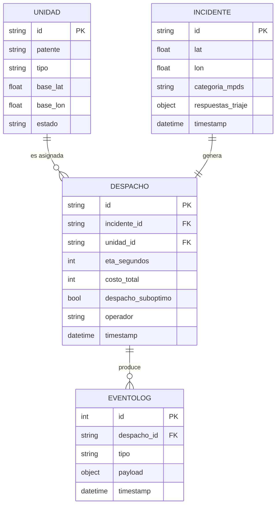

# Modelo de datos

> Entidades del dominio. La persistencia v1 es JSONL append-only (ver [ADR-0007](architecture/decisions/0007-persistencia-jsonl.md)), pero el modelo conceptual se mantiene independiente del medio de almacenamiento.

## Entidades

- **Unidad** (`U01`–`U10`): id, patente, tipo (Avanzada/Básica), base (lat, lon), estado (Disponible/EnRuta/EnEscena/Taller).
- **Incidente** (`I-NNNN`): id, lat, lon, timestamp, categoria_mpds, respuestas_triaje (objeto estructurado — ver abajo).
- **Despacho** (`SD-YYYYMMDD-NNNN`): id, incidente_id, unidad_id, eta_segundos, costo_total, despacho_suboptimo (bool), operador, timestamp.
- **EventoLog**: id, despacho_id, tipo (`despacho_creado` | `despacho_cancelado` | `despacho_finalizado` | `redespacho_propuesto` | `redespacho_confirmado` | `redespacho_rechazado` | `unidad_actualizada`), payload_json, timestamp. **Append-only** (RN-03, RN-07).

## RespuestaTriaje — estructura

Refleja las variables del operador definidas en SRS sec. 2.5 y procesadas por el árbol MPDS-subset (sec. 2.6-A, [ADR-0009](architecture/decisions/0009-refinamiento-arbol-triaje.md)).

```json
{
  "consciente": true,
  "respira_normal": true,
  "sangrado": "Moderado",
  "dolor_toracico": "Ninguno",
  "dificultad_respiratoria": false,
  "grupo_etario": "Adulto"
}
```

| Campo | Tipo | Valores | Referencia MPDS |
|---|---|---|---|
| `consciente` | bool | `true`, `false` | Pre-pregunta Protocol 31 |
| `respira_normal` | bool | `true`, `false` | Distingue 31-D-2 vs 9-E-1 / 31-E-1 |
| `sangrado` | enum | `"Ninguno"`, `"Moderado"`, `"Activo"`, `"Peligroso"` | Protocol 21: (n/a) / 21-B-2 / [adaptación SAMU] / 21-D-4 |
| `dolor_toracico` | enum | `"Ninguno"`, `"Presente"`, `"Crítico"` | Protocol 10: (n/a) / 10-C / 10-D |
| `dificultad_respiratoria` | bool | `true`, `false` | Protocol 6 / Protocol 31-C-1 |
| `grupo_etario` | enum | `"Pediátrico"`, `"Adulto"`, `"Anciano"` | Reservado para subdeterminantes futuros (ej. 6-D-1 pediátrico) |

## ERD Mermaid



## Invariantes

- Una `Unidad` con estado `Taller` no puede aparecer en `Despacho` (RN-04).
- `EventoLog` es append-only por construcción (ADR-0007): el código no expone API de UPDATE/DELETE; cualquier corrección requiere un evento posterior (RN-03, RN-07).
- `despacho_suboptimo=true` implica unidad `Básica` despachada a Echo o Delta por saturación crítica (RN-02).
- El `respuestas_triaje` siempre tiene los 6 campos definidos arriba; un campo faltante es error de validación de entrada.
- Si `consciente=true`, la respuesta `respira_normal` se considera no aplicable (cualquier valor); el árbol no la consulta en esa rama.

## Persistencia

- **`data/eventos.jsonl`**: log inmutable. Una línea = un evento JSON validado por Pydantic en escritura. Ignorado por git (estado runtime).
- **`data/dataset/incidentes.json`**: dataset de aceptación de los 12 incidentes (sec. 2.12 del SRS). Versionado en git.
- **`data/dataset/unidades.json`**: inventario de las 10 unidades U01..U10 (sec. 2.12 del SRS). Versionado en git.
- **`data/graphs/coquimbo.graphml`**: grafo OSM IV Región. Generado por `core-python/scripts/build_graph.py`. Ignorado por git (pesado, regenerable).

## Referencias

- [SRS sec. 2.5, 2.6-A, 2.12](SRS.md) — fuente normativa.
- [ADR-0006 — Ports & Adapters](architecture/decisions/0006-ports-and-adapters.md) — el modelo vive en `domain/`.
- [ADR-0007 — Persistencia JSONL](architecture/decisions/0007-persistencia-jsonl.md) — medio de almacenamiento.
- [ADR-0009 — Refinamiento del árbol MPDS-subset](architecture/decisions/0009-refinamiento-arbol-triaje.md) — origen de los enums de respuesta.
