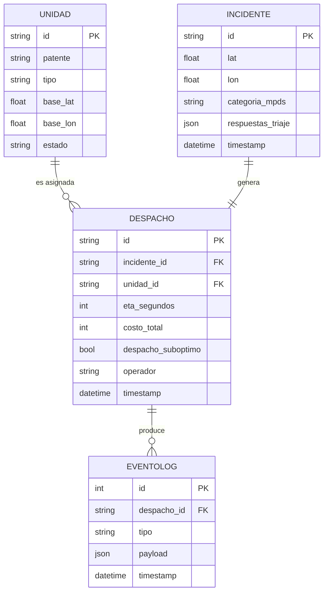

# Modelo de datos

> **Estado:** placeholder. ERD final pendiente F2.

## Entidades

- **Unidad** (`U01`–`U10`): id, patente, tipo (Avanzada/Básica), base (lat, lon), estado (Disponible/EnRuta/EnEscena/Taller).
- **Incidente** (`I-NNNN`): id, lat, lon, timestamp, categoría_mpds, respuestas_triaje (JSON).
- **Despacho** (`SD-YYYYMMDD-NNNN`): id, incidente_id, unidad_id, eta_segundos, costo_total, despacho_suboptimo (bool), operador, timestamp.
- **EventoLog**: id, despacho_id, tipo (creacion|cancelacion|finalizacion|redespacho), payload_json, timestamp. **Append-only** (RN-03, RN-07).

## ERD Mermaid (placeholder)

## Invariantes

- Una `Unidad` con estado `Taller` no puede aparecer en `Despacho` (RN-04).
- `EventoLog` es append-only; intentos de UPDATE/DELETE deben fallar (RN-07).
- `despacho_suboptimo=true` implica unidad `Básica` despachada a Echo o Delta.
